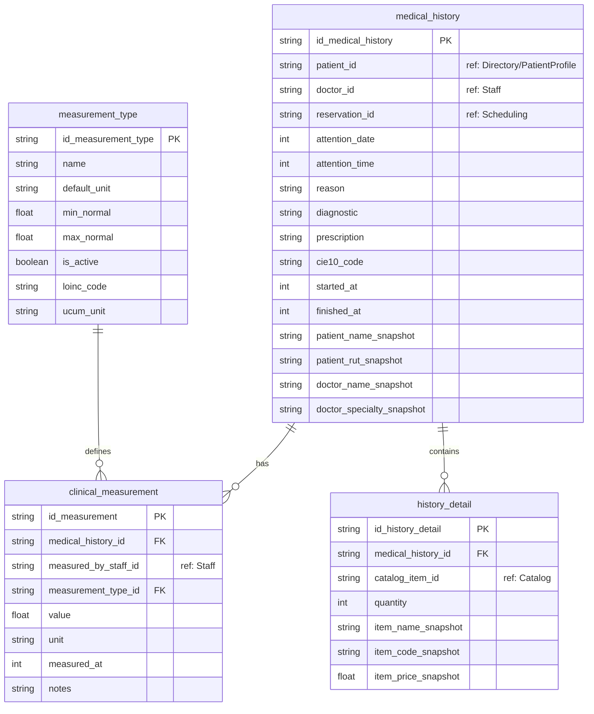

```mermaid
erDiagram
    medical_history {
        string id_medical_history PK
        string patient_id "ref: Directory/PatientProfile"
        string doctor_id "ref: Staff"
        string reservation_id "ref: Scheduling"
        int attention_date
        int attention_time
        string reason
        string diagnostic
        string prescription
        string cie10_code
        int started_at
        int finished_at
        string patient_name_snapshot
        string patient_rut_snapshot
        string doctor_name_snapshot
        string doctor_specialty_snapshot
    }

    measurement_type {
        string id_measurement_type PK
        string name
        string default_unit
        float min_normal
        float max_normal
        boolean is_active
        string loinc_code
        string ucum_unit
    }

    clinical_measurement {
        string id_measurement PK
        string medical_history_id FK
        string measured_by_staff_id "ref: Staff"
        string measurement_type_id FK
        float value
        string unit
        int measured_at
        string notes
    }

    history_detail {
        string id_history_detail PK
        string medical_history_id FK
        string catalog_item_id "ref: Catalog"
        int quantity
        string item_name_snapshot
        string item_code_snapshot
        float item_price_snapshot
    }

    medical_history ||--o{ clinical_measurement : "has"
    measurement_type ||--o{ clinical_measurement : "defines"
    medical_history ||--o{ history_detail : "contains"
```
